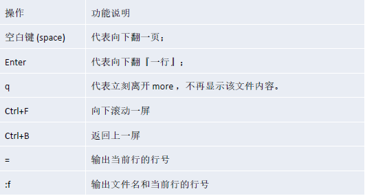
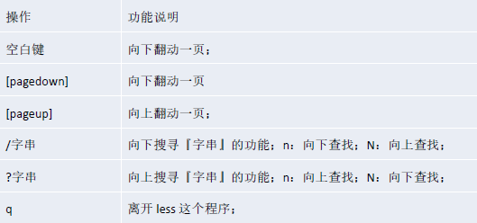

## linux的目录结构

1. linux只有一个根目录 `/`

2. linux的命令都有对应的目录

3. 层级式的目录

   关键目录：

   ​	bin、usr/bin：系统的可执行文件，可以在任意目录下执行

   ​	usr/local/bin：存放用户自己的可执行文件，也可以在任意目录下执行

   ​	etc：存放配置文件，例如配置环境变量（etc/profile）

   ​	home：每一个用户的根目录，子目录目录名即为用户名

   ​	opt：存档额外的软件，与Windows的Program Files相似

## linux的远程操作

1. XShell（SSH协议）

​		linux获取ip地址：ifconfig

2. Xftp

   进行文件传输（SFTP协议）

## vi和vim

一般模式：使用vi或者vim命令打开文件(文件不存在则创建)，就会进入一般模式

​					这种模式下可以查看文件内容，但是不能修改内容

编辑模式：在一般模式下，按 a 或 i 键进入编辑模式

​					编辑模式不会自动保存

​					按`Esc`可以回到一般模式

命令模式：在一般模式下，按`shift` + `:` ，进入命令模式

​					输入:	q!	不保存强制退出编辑器

​								wq	保存并且退出编辑器

​								q		只是退出编辑器，如果有未保存内容会进行提示

## vim的快捷键

1. 复制： 按 `yy` 复制当前行，按 `nyy` 复制n行（n为数字）,按p黏贴

2. 查找：按 `/<关键字>` ,查找对应关键字，按n表示查找下一个关键字
3. 删除：dd`删除当前行, `ndd`删除当前行即下面n-1行。
4. 撤销删除：按u（以上快捷键均在一般模式下）
5. 行号显示：`set nu` 显示行号，`set nonu` 隐藏行号
6. 跳行：`gg`文件首行，`G`文件尾行，`n + shift + g`(n为数字)，跳到第n行

## Linux用户管理

#### 添加用户

命令：`useradd <username>` 会创建新目录在/home下，目录名即为用户名。

​	在linux中任何一个用户都至少属于一个组，新建用户不指定组，就会新建组，组名与用户名相同。

​	可以使用参数-d指定新用户的目录名(不常用)

​		形式：  `useradd -d <userPath> <username>`  ，即为新用户`username`对应的目录为`<userPath>`。

#### 设置密码

创建用户后，必须有合法的密码才能使用，所以需要给用户设置密码。

设置密码需要超级管理员的权限，所以需要root账户或者sudo账户进行设置。

设置密码的流程：切换到用户目录下，使用以下命令

命令格式：`passwd [userName]` 

​	当省略userName时则默认更改当前用户

#### 删除用户

`userdel  <userName>` : 删除用户，但不删除用户对应的目录

`userdel -r <userName>` : 删除用户，并级联删除目录

#### 查看用户

`id <userName>`

#### 切换用户

`su <userName>`

从权限高的用户切换到权限低的不需要密码，反之则需要。

#### 组管理

1. 添加组

   `groupadd <groupName>` 

2. 删除组

​		`groupdel <groupName>`

3. 将用户添加到组中

​		`gpasswd -a <userName> <groupName>`

4. 将用户从组中移除

​		`gpasswd -d <userName> <groupName>`

5. 添加用户时，指定所属组

​		`useradd -g <groupName> <userName>`

## 实操指令

#### 帮助指令

1. 查看linux系统手册的帮助信息：`man <command>`

   回车翻一行，空格翻一页，q退出

2. 查看命令内置帮助信息（比较简陋）：`help <command>`

#### 文件目录指令

1. 查看当前所在目录：`pwd`  (全称`print working directory`)

2. 查看指定目录下的所有子目录和文件：`ls [path]` (省略path时为当前目录)

   ​	添加`-a`选项则列出所有目录（包括隐藏目录和`.`、`..`），添加`-l`选项则以列表形式列出

   ​	组合选项可以 `-a -l`或者 `-al` 或 `-la`

3. 切换目录：`cd <path>` （path可以为 绝对路径[从/开始]、 相对路径[从当前目录开始]、`.` 、 `..` ）

4. 创建目录：`mkdir <path>` （可以写的路径和上面一样, 默认只能创建以及目录）

   添加`-p`选项，创建多级目录

5.  删除一个空目录：`rmdir <directory>`

6. 创建文件：`touch <filePath list>` （可以创建多个文件，以空格分割）

7. 复制文件：`cp <sourcePath> <destPath>`

​		`sourcePath` : 文件路径

​		`destPath` : 目标目录或目标文件，当为目录时即将文件拷贝到目录下（文件名与源文件相同），当为文件时，即将目标文件覆盖。

​		添加`-r` 选项，`sourcePath` 可以为一个目录，将目录递归复制到目标目录下

8. 删除文件或目录：`rm <filePath>` （删除文件）

   添加`-r`选项可以递归删除目录，但是会弹出很多提示

   再添加`-f`选项可以强制删除，无提示

9. 移动文件或者目录：`vm <sourcePath> <destPath>` 

   当`sourcePath`和`destPath`均是文件且在同一目录下，相当于重命名

   如果`sourcePath`和`destPath`均是目录，

   ​	当`destPath`不存在时，相当于重命名；

   ​	当`destPath`存在时，将会把`sourcePath`目录放到`distPath`目录下

10. 查看文件（以只读形式）

​		`cat <filePath>` : 查看文件以标准形式输出到控制台

​			添加`-n`选项，会显示行号

​			添加`|more` 管道，可以以整页的形式展示，形式：`cat <filePath> |more`

​			添加`|less` 管道，可以以整页的形式展示，但是不会输出到控制台，退出后内容就关闭了

​		`more <filePath>`: 与上面添加`|more`管道类似，但是不能显示行号

​				以下是`more`状态下读文件对应操作

​				

​		`less <filePath>`: 与上面添加`|less`管道类似

​				以下是`less`状态下读文件对应操作

​				

​		`head|tail -n -<number>` : 读取前`number`行或后`number`行，当省略`-n -<number>`时默认为10行

11.输出变量

​	`echo $<name>`：输出变量（环境变量或者用户自定义的变量）, 不添加$会当作常量直接输出

​	`echo $(<name>)`:  输出变量结果，例如`echo $(date)`会输出时间

12. 命令结果输出到文件

    `>`命令：例如`echo  $PATH > /opt/path.txt` 即将`echo  $PATH`结果输出到`path.txt`文件中，文件不存在则新建

    `>>`命令：将命令结果以追加形式写入文件中，文件不存在则新建

    可以利用这些操作进行文件覆盖，例如`cat <sourcePath>  >  <distPath>`

#### 查看日期和日历

​	`date`（功能描述：显示当前时间）

​	`date +%Y`（功能描述：显示当前年份）

​	`date +%m`（功能描述：显示当前月份）

​	`date +%d`（功能描述：显示当前是哪一天）

​	`date "+%Y-%m-%d %H:%M:%S"`（功能描述：显示年月日时分秒）

​		这个字符串可以自定义，但要以+号开头，比如 `date "+%Y-%m"`

​	`date -s` 字符串时间（功能描述：设置日期）,例如 date -s '2023-09-07 12:24:25'

​	`cal` 显示当前月的日历

​	`cal 2023` 显示2023年的日历

​	`cal 2023 09` 显示2023年9月的日历

#### 搜索文件

​	`find <directory> [options]` :   不输入起始目录时，默认情况下从当前目录开始，且只搜索当前一层子目录和文件，支持通配符;

​				输入目录时，则从目录及其子目录开始搜索所有文件，或者存在`options`时也是。

​			`-name`：示例：`find -name '*.txt'`，参数需要是字符串，默认从当前目录及其子目录搜索，搜索所有层级的文件和目录

​			`-size`：示例：`find -size +5M` 文件大于5MB

​			`-user`：示例：`find -user root` 由root创建的文件

​	`locate` ：从文件数据库中搜索，如果要保证搜索结果正确，需要在搜索前更新数据库，使用命令`updatedb`

​	过滤文件

​		`grep [options] <pattern> <file>`: 过滤得到文件中包含`pattern`模式的行 

​		可以作为管道，比如`find * |grep test` 

#### 压缩和解压文件

​		1. 压缩和解压单个文件：`gzip <file>`        `gunzip <file>`

​					压缩和解压前后文件都会替换

​		2. 压缩和解压多个文件和目录：`zip <zipName> <directory|files>`     `unzip <zipFile>`

​					压缩和解压前后文件不会消失，只是新增加了压缩文件或者解压后的文件

​					选项`-d` ： 指定解压到哪个目录

​		3. 压缩或解压多个文件和目录：`tar [options] [-C <directory>]`

​					选项：

​						-c：产生.tar.gz打包文件

​						-v：显示详细信息

​						-f：指定压缩后的文件名

​						-z：打包同时压缩

​						-x：解压.tar.gz文件

​						-C: 指定解压到哪个目录

​				一般压缩：`tar -zcvf  压缩文件名  压缩文件或目录列表`

​				一般解压：`tar -zxvf  解压文件名  [-C 解压目录位置]`

#### 文件和组

1. 每一个用户至少属于一个组，不能独立于组存在，一个用户可以属于多个组。

    每一个文件或目录也必须属于一个组，且仅能属于一个组。

​		文件或者目录可以通过组来控制哪些用户可以对它进行哪些操作，即控制文件或目录的访问权限。

​		对于文件和目录，用户可以分为三类：

​				所有者：默认情况，文件和目录的所有者是其创建者，可以修改

​				同组用户：和文件或目录属于同一组的用户

​				其他用户：除了以上两种用户

2. 查看文件的组：`ls -l`    ,以列表形式展示，会包含组信息

3. 修改文件的所有者：`chown <newOwner> <file|directory>`

​											`chown <newOwener>:<newGroup> <file|directory>`  示例 `chown xjs:xjs test.txt`

4. 修改文件的组：`chgrp <newGroup> <file>` 

   ​		实际上可以：`chown :<newGroup> <file|directory>` 相当于上面的`newOwner`不改变

#### 文件目录权限

​	1. 文件和目录有三种权限：读(Read)、写(Write)、执行(Execute)

​			对于文件：

​				读：cat, more, less, head, tail等

​				写：vi，vim等

​				执行：如何该文件是可执行文件(.sh)，可以直接运行，比如./xxx.sh

​			对于目录：

​				读：ls等

​				写：mkdir, rm, touch等，像对文件的增加、删除、重命名实际上都是对目录的修改，需要对目录的写权限

​				执行：cd等

 2. 文件或目录的控制权限

    ​	任何一个文件有三部分权限：所有者权限，同组用户权限，其他组用户权限。

    ​		这三部分权限每部分权限由三个字母组成，rwx，可以通过`ls -l`命令查看权限，

​					`ls -l`命令结果的第一列是10个字母，第一个字母代表是否为目录，如果是字母d，则是目录，否则为文件；

​									后九个字母每三个字母代表一部分权限，例如：r-x代表读和执行权限，没有写。

​			root的超级权限体现在管理用户上，在不修改权限的情况下root用户在访问文件上与普通用户没有什么区别；

​					但是root和文件拥有者可以修改文件的权限。

3. 修改权限

   `chmod u=rwx,g=rx,o=r ` 

   `chmod o+w`

   `chmod g-x`

​			形式：`chmod <user><operator><limit>`

​				`<user>` 可以为u、g、o、a，分别代表拥有者，同组用户，其他用户，全部用户

​				`<operator>`可以为+、-、=,

​		还可以采用数字状态压缩来表示权限，例如rwx是111(2) --> 7,  r-x是101(2) --> 5，

​			这样三种权限就可以压缩成三个数字，那么`chmod 644 testPremission`就会将权限状态变为 `rw-r--r--`

## 网络配置
